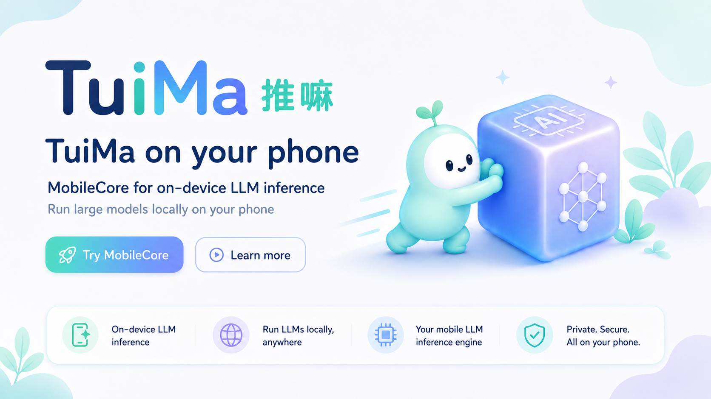
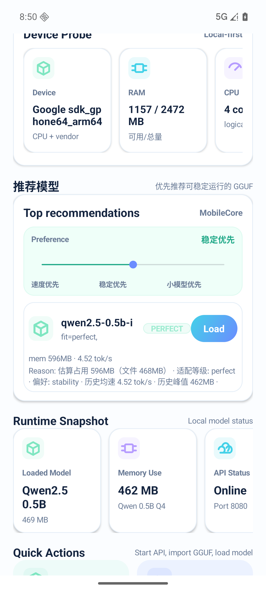
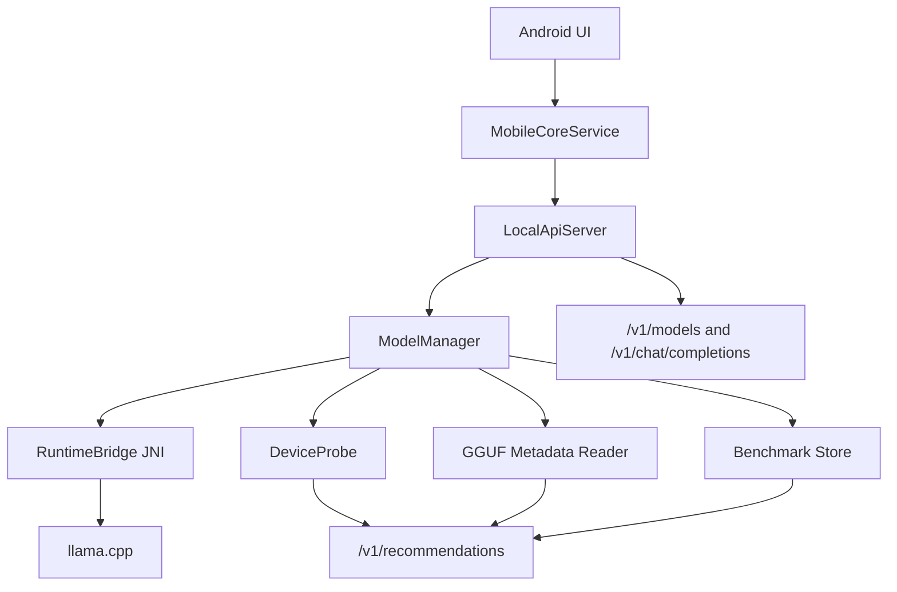

<p align="center">
  
</p>

<h1 align="center">MobileCore / 推嘛 TuiMa</h1>

<p align="center">
  Android local LLM runtime plus an iOS native skeleton for GGUF models, llama.cpp inference, OpenAI-compatible APIs, real benchmarks, and device-aware model recommendations.
</p>

<p align="center">
  
  
  
  
  
  
</p>

<p align="center">
  <a href="#quick-start">Quick Start</a> ·
  <a href="#api">API</a> ·
  <a href="#benchmarks">Benchmarks</a> ·
  <a href="game-web/README.md">TuiMa Game</a> ·
  <a href="android-app/README.md">Android Guide</a> ·
  <a href="ROADMAP.md">Roadmap</a>
</p>

MobileCore is the local model runtime layer of the Mobile AI Stack. It runs small and mid-size LLMs on Android phones, manages GGUF model files, exposes a localhost OpenAI-compatible API, records real runtime metrics, and recommends models based on the current device. The iOS app now has a buildable SwiftUI skeleton with Files import, an Objective-C++ llama.cpp bridge, and foreground localhost routes.

It is designed to sit below MobileCode or any other mobile app that wants to call a local LLM through `http://127.0.0.1:8080/v1`.

## What Works Now

| Area | Current state |
| --- | --- |
| Android app | Kotlin app with `MainActivity`, foreground `MobileCoreService`, notification permission handling, and model actions |
| iOS app | SwiftUI app under `ios-app/` with Files-based GGUF import, `Documents/MobileCore/models`, Objective-C++ llama.cpp bridge, and foreground localhost API |
| Local API | NanoHTTPD server on `127.0.0.1:8080` with `/v1/models`, `/v1/chat/completions`, `/metrics`, `/health`, and model management routes |
| Native runtime | JNI bridge loads `mobilecore_llama`, builds llama.cpp through CMake, and falls back to mock mode when native loading fails |
| Model flow | Import GGUF from Android file picker or push model files with `adb`; load/unload through app buttons or local API |
| Recommendations | `/v1/recommendations?preference=speed\|stability\|small` uses device probing, GGUF metadata, scoring config, and stored benchmark history |
| Benchmarks | Records prompt eval time, first token latency, decode loop time, total time, tok/s, prompt tokens, completion tokens, and memory peak |
| TuiMa Push Game | Static React/Vite MVP in `game-web/` with an 8x8 push-model board, MobileCore localhost speed calls, signed result checks, Supabase-ready shared leaderboard, local fallback entries, and custom board JSON flow |

## Visual Proof

MobileCore keeps the updated TuiMa product direction and the current Android validation evidence side by side: the wide banner at the top introduces the latest "MobileCore on your phone" visual, the square card below shows the refreshed TuiMa brand direction, and the phone screenshot is real AVD evidence with device probing, preference control, ranked recommendations, benchmark-backed stats, and a direct `Load` action.

<p align="center">
  
  
</p>

## Quick Start

Requirements:

- Android Studio or an Android SDK installation with `adb`
- JDK 17
- Android NDK `28.2.13676358`
- CMake `3.22.1`

Build the debug APK:

```bash
cd android-app
./scripts/bootstrap-llama.sh
./gradlew :app:assembleDebug
```

Install and start the app:

```bash
adb install -r app/build/outputs/apk/debug/app-debug.apk
adb shell am start -n com.mobilecore.app/ai.mobilecore.MainActivity
```

Forward the local API port:

```bash
adb forward tcp:8080 tcp:8080
```

Download a small GGUF model and load it:

```bash
cd android-app
./scripts/download-gguf.sh --provider modelscope --alias qwen2.5-0.5b-q4km --push --load
```

Hugging Face is also supported:

```bash
./scripts/download-gguf.sh --provider hf --alias smollm2-135m-q4km
```

Build the iOS skeleton:

```bash
cd ios-app
xcodebuild -project MobileCoreiOS.xcodeproj \
  -scheme MobileCoreiOS \
  -destination 'generic/platform=iOS Simulator' \
  build
```

Open `ios-app/MobileCoreiOS.xcodeproj` in Xcode to run the SwiftUI app, import a `.gguf` through Files, load the model, and start the foreground local API.
The iOS build reuses `android-app/third_party/llama.cpp`; run `android-app/scripts/bootstrap-llama.sh` first if that checkout is missing.

## API

List available models:

```bash
curl -H "Authorization: Bearer local" \
  http://127.0.0.1:8080/v1/models
```

Run a non-streaming chat completion:

```bash
curl -X POST http://127.0.0.1:8080/v1/chat/completions \
  -H "Authorization: Bearer local" \
  -H "Content-Type: application/json" \
  -d '{
    "model": "local-model",
    "messages": [{"role": "user", "content": "Say hello from MobileCore"}],
    "max_tokens": 32
  }'
```

Ask for model recommendations:

```bash
curl -H "Authorization: Bearer local" \
  "http://127.0.0.1:8080/v1/recommendations?preference=stability"
```

Read latest benchmark metrics:

```bash
curl -H "Authorization: Bearer local" \
  http://127.0.0.1:8080/metrics
```

The Android local API allows the GitHub Pages origin `https://harzva.github.io` plus localhost dev origins, including Private Network Access preflight headers. TuiMa Push verifies the `mobilecore.benchmark_signature` returned by `/v1/chat/completions` before sending a result to the shared Supabase leaderboard.

## Benchmarks

Latest local validation, measured on an Android AVD on 2026-06-20 with `Qwen2.5-0.5B-Instruct-Q4_K_M.gguf`:

| Metric | Result |
| --- | ---: |
| Model load | 1326 ms |
| Prompt eval | 1494 ms |
| First token | 1496 ms |
| Decode loop | 1770 ms |
| Total chat | 3265 ms |
| Decode speed | 4.52 tok/s |
| Memory peak | 462 MB |

These numbers are AVD smoke-test evidence, not a production phone benchmark. Real-device results should be collected separately and will feed the recommendation ranking through `ModelBenchmarkStore`.

## Architecture



## Repository Layout

```text
MobileCore/
├── android-app/              # Kotlin Android app, NanoHTTPD server, JNI bridge, CMake
├── ios-app/                  # SwiftUI iOS app, Files GGUF import, Objective-C++ llama.cpp bridge
├── docs/                     # Architecture, API contracts, benchmark plan, README assets
├── examples/                 # MobileCode provider preset
├── game/                     # TuiMa Push Game product specs, schemas, Supabase draft, and source assets
├── game-web/                 # Static React/Vite MVP for the TuiMa Push benchmark game
├── src/                      # Runtime contracts and native backend notes
├── tests/                    # Manual smoke-test docs
├── design-assets/            # MobileCore and TuiMa product UI / brand reference images
└── MobileCore-P0-Probe/      # Early P0 probe notes and scripts
```

Large local-only files are intentionally excluded from Git:

- `android-app/third_party/llama.cpp` is restored by `android-app/scripts/bootstrap-llama.sh`.
- `android-app/.model-cache` stores downloaded GGUF files.
- `android-app/qa-output` stores local screenshots, logs, and API captures.
- `reference/` is for local research checkouts.

## Roadmap

- Finish streaming chat completions and configurable samplers.
- Add real-device benchmark profiles for speed, stability, memory, heat, and battery.
- Expand model metadata parsing across more GGUF naming conventions and metadata keys.
- Let benchmark history continuously improve recommendations per device.
- Complete Vision OCR / CLIP preprocessing and postprocessing on top of the bundled ONNX Runtime / TFLite model-load probes.
- Add iOS streaming chat, configurable sampling, benchmark persistence, and Metal acceleration.
- Add optional Google Sign-In later for shared leaderboards, cloud score sync, and profile continuity. Local inference, model import, and localhost APIs should continue to work without login.

## Name

- Technical name: **MobileCore**
- Product name: **推嘛 / TuiMa**
- Role in stack: local model runtime below MobileCode

## License

No license has been selected yet. Treat the repository as source-available until a license file is added.
