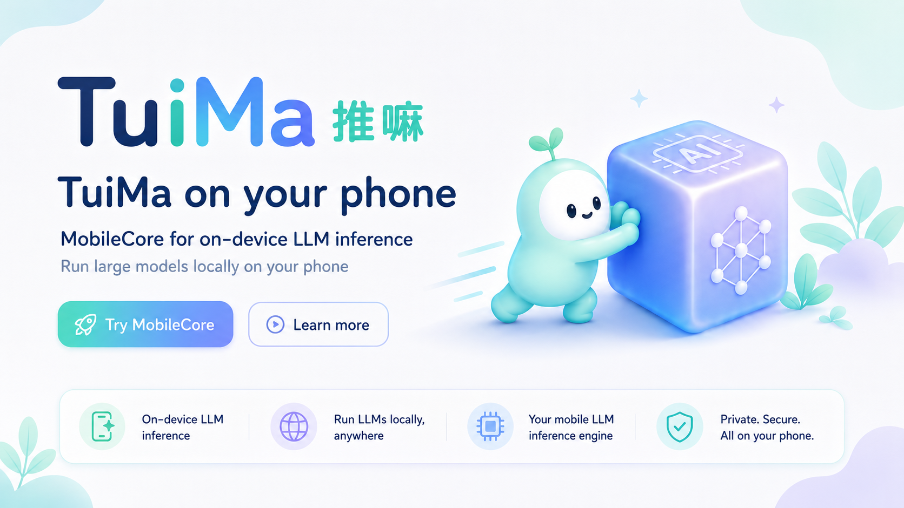
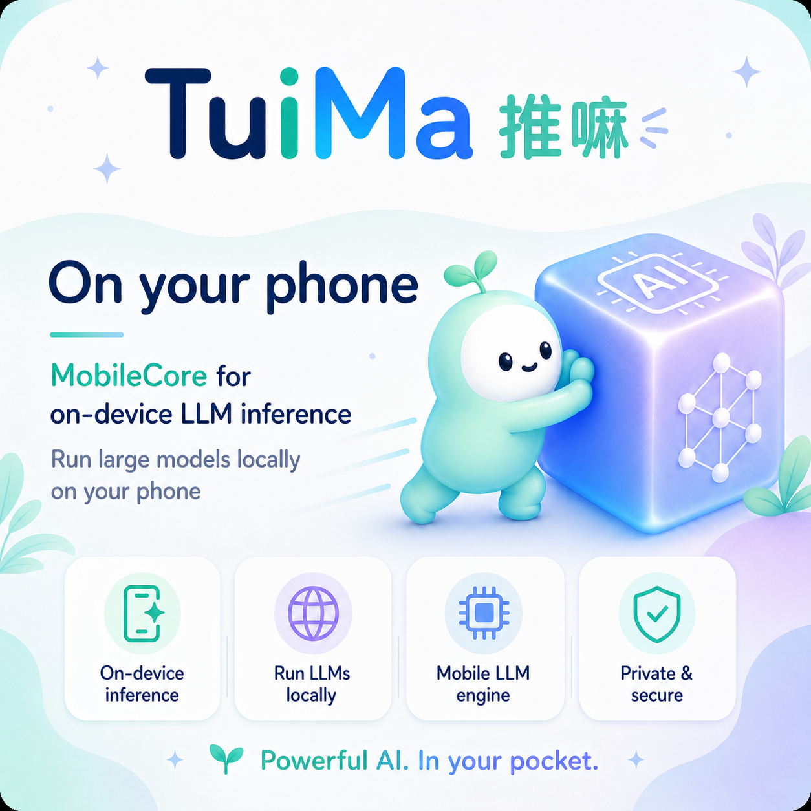
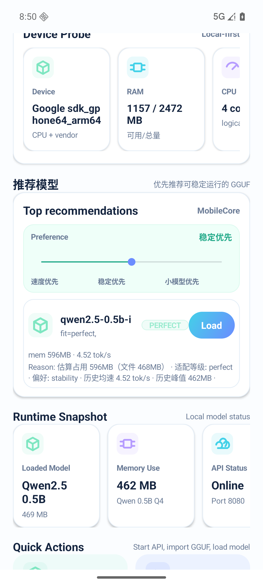
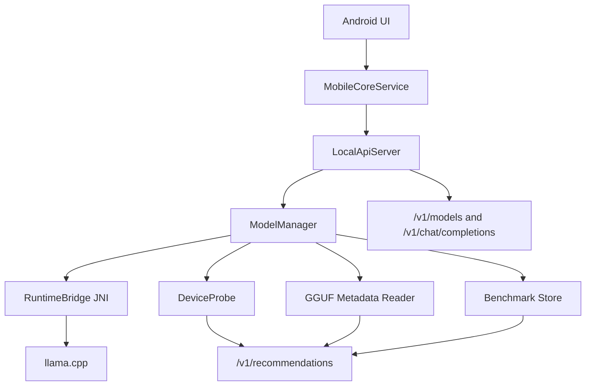

<p align="center">
  
</p>

<h1 align="center">MobileCore / 推嘛 TuiMa</h1>

<p align="center">
  Android local LLM runtime plus an iOS native skeleton for GGUF models, llama.cpp inference, OpenAI-compatible APIs, real benchmarks, and device-aware model recommendations.
</p>

<p align="center">
  
  
  
  
  
  
  
</p>

Latest Android prerelease: [TuiMa 0.1.4 RC4](https://github.com/Harzva/mobilecore/releases/tag/v0.1.4-rc4). The official upload-signed APK was built by [GitHub Actions run 31127904733](https://github.com/Harzva/mobilecore/actions/runs/31127904733) from commit `07abdf0d` and has SHA-256 `6ea2b9c80e55d7c98e0ac2f85bf003141472d73328cb10c34acee33619018df5`. The separately labeled debug-signed APK is QA-only.

<p align="center">
  <a href="#quick-start">Quick Start</a> ·
  <a href="#api">API</a> ·
  <a href="#benchmarks">Benchmarks</a> ·
  <a href="game-web/README.md">TuiMa Game</a> ·
  <a href="android-app/README.md">Android Guide</a> ·
  <a href="ROADMAP.md">Roadmap</a>
</p>

MobileCore is the local model runtime layer of the Mobile AI Stack. It runs small and mid-size LLMs on Android phones, manages GGUF model files, exposes a localhost OpenAI-compatible API, records real runtime metrics, and recommends models based on the current device. The iOS app now has a buildable SwiftUI skeleton with Files import, an Objective-C++ llama.cpp bridge, and foreground localhost routes.

It is designed to sit below MobileCode or any other mobile app that wants to call a local LLM through `http://127.0.0.1:8080/v1`.

## What Works Now

| Area | Current state |
| --- | --- |
| Android app | Kotlin app with `MainActivity`, foreground `MobileCoreService`, notification permission handling, and model actions |
| iOS app | SwiftUI app under `ios-app/` with Files-based GGUF import, `Documents/MobileCore/models`, Objective-C++ llama.cpp bridge, and foreground localhost API |
| Local API | NanoHTTPD server on `127.0.0.1:8080` with `/v1/models`, `/v1/chat/completions`, `/metrics`, `/health`, recommendations, and model-ID load/unload routes |
| Native runtime | JNI bridge loads `mobilecore_llama`, builds llama.cpp through CMake, and falls back to mock mode when native loading fails |
| Model flow | Import GGUF from Android file picker or push model files with `adb`; load/unload text models and compatible main-GGUF/mmproj vision pairs through app buttons or local API |
| Recommendations | `/v1/recommendations?preference=speed\|stability\|small` uses device probing, GGUF metadata, scoring config, and stored benchmark history |
| Benchmarks | Records prompt eval time, first token latency, decode loop time, total time, tok/s, prompt tokens, completion tokens, and memory peak |
| TuiMa Push Game | Static React/Vite MVP in `game-web/` with an 8x8 push-model board, MobileCore localhost speed calls, signed result checks, Supabase-ready shared leaderboard, local fallback entries, and custom board JSON flow |

## Visual Proof

MobileCore keeps the updated TuiMa product direction and the current Android validation evidence side by side: the wide banner at the top introduces the latest "MobileCore on your phone" visual, the square card below shows the refreshed TuiMa brand direction, and the phone screenshot is real AVD evidence with device probing, preference control, ranked recommendations, benchmark-backed stats, and a direct `Load` action.

<p align="center">
  
  
</p>

## Quick Start

Requirements:

- Android Studio or an Android SDK installation with `adb`
- JDK 17
- Android NDK `28.2.13676358`
- CMake `3.22.1`

Build the debug APK:

```bash
cd android-app
./scripts/bootstrap-llama.sh
./gradlew :app:assembleDebug
```

Install and start the app:

```bash
adb install -r app/build/outputs/apk/debug/app-debug.apk
adb shell am start -n com.mobilecore.app/ai.mobilecore.MainActivity
```

Forward the local API port:

```bash
adb forward tcp:8080 tcp:8080
```

Download a small GGUF model and load it:

```bash
cd android-app
./scripts/download-gguf.sh --provider modelscope --alias qwen2.5-0.5b-q4km --push --load
```

Hugging Face is also supported:

```bash
./scripts/download-gguf.sh --provider hf --alias smollm2-135m-q4km
```

Build the iOS skeleton:

```bash
cd ios-app
xcodebuild -project MobileCoreiOS.xcodeproj \
  -scheme MobileCoreiOS \
  -destination 'generic/platform=iOS Simulator' \
  build
```

Open `ios-app/MobileCoreiOS.xcodeproj` in Xcode to run the SwiftUI app, import a `.gguf` through Files, load the model, and start the foreground local API.
The iOS build reuses `android-app/third_party/llama.cpp`; run `android-app/scripts/bootstrap-llama.sh` first if that checkout is missing.

## API

List available models:

```bash
curl -H "Authorization: Bearer local" \
  http://127.0.0.1:8080/v1/models
```

Run a non-streaming chat completion:

```bash
curl -X POST http://127.0.0.1:8080/v1/chat/completions \
  -H "Authorization: Bearer local" \
  -H "Content-Type: application/json" \
  -d '{
    "model": "local-model",
    "messages": [{"role": "user", "content": "Say hello from MobileCore"}],
    "max_tokens": 32
  }'
```

Ask for model recommendations:

```bash
curl -H "Authorization: Bearer local" \
  "http://127.0.0.1:8080/v1/recommendations?preference=stability"
```

Read latest benchmark metrics:

```bash
curl -H "Authorization: Bearer local" \
  http://127.0.0.1:8080/metrics
```

Load or unload an installed model without exposing its file path:

```bash
curl -X POST http://127.0.0.1:8080/mobilecore/model/load \
  -H "Authorization: Bearer local" \
  -H "Content-Type: application/json" \
  -d '{"model_id":"qwen2.5-0.5b-instruct-q4_k_m","context_length":2048}'

curl -X POST http://127.0.0.1:8080/mobilecore/model/unload \
  -H "Authorization: Bearer local" \
  -H "Content-Type: application/json" \
  -d '{}'
```

`/v1/models` and `/v1/recommendations` return public model identifiers and never return absolute model paths. A compatible `mmproj-*.gguf` is exposed as projector metadata on its main model, not as a standalone language model. Loading by `model_id` auto-pairs one unambiguous same-family projector; an optional public `projector_id` is accepted and compatibility-checked. The legacy path input remains only for bounded host QA compatibility.

The Android local API allows the GitHub Pages origin `https://harzva.github.io` plus localhost dev origins, including Private Network Access preflight headers. TuiMa Push verifies the `mobilecore.benchmark_signature` returned by `/v1/chat/completions` before sending a result to the shared Supabase leaderboard.

## MobileCode Integration

MobileCore reports the active model, runtime, revision, backend, quantization, capability snapshot, active-model resource preflight, artifact state, recommendations, and decode metrics. MobileCode uses this snapshot for routing and presents load/unload/switch controls without learning local file paths.

MobileCore `0.1.4-rc6` publishes the strict `mobilecore.local` v2 compatibility range and Android `background_restricted` state in `/health`, allowing clients to fail closed before local routing when the handshake is incompatible or Android will not allow MobileCore to remain active. Timeout and user-pause paths call the authenticated local cancellation endpoint so native decoding does not continue after MobileCode stops waiting.

The boundary is deliberate: MobileCore performs local inference only. MobileCode owns cloud consent, Phone Use, transaction approvals, clicks, credentials, and ActionEvidence. MobileCore has no device-action API.

On 2026-08-06, a same-emulator dual-app lane passed 30 real offline requests from the MobileCode instrumentation process to MobileCore: 15 buffered completions and 15 SSE completions. Model unload/reload, a real Qwen2.5-to-Qwen3 switch, background continuity, low-memory notification, and process restart recovery also passed. A separate real Qwen3.5 0.8B GGUF/mmproj run completed an image request through the unified API. The tested image was classified incorrectly, so this proves the local multimodal chain rather than model accuracy. No physical Android device was available; physical thermal/device claims remain open.

On 2026-08-07, the exact final-tag upload-signed `0.1.4-rc6` APK was update-installed without deleting the real Qwen2.5 0.5B model. The Android 16 dual-app background lane kept MobileCode resumed for 40 polls (about two minutes); all 40 authenticated health checks passed, MobileCore stayed a typed `dataSync` foreground service, and neither process freezing nor FGS/ANR/OOM safety failures were observed. One controlled local inference also completed with zero request failures. See the [rc6 release evidence](docs/release/tuima-0.1.4-rc6.md). A deliberately background-restricted emulator state was rejected during preflight and is not counted as a runtime pass.

The next Android candidate adds a MobileCore-owned Qwen2.5-Omni lifecycle screen: live pre-consent resource projection, publisher/license disclosure, one-use explicit consent, and install/cancel/verify/load/uninstall controls. An isolated Android 16 ARM64 AVD with insufficient memory correctly omitted the install action and downloaded no artifact. This is a fail-closed UI/control-path result, not evidence that the 3.64 GB pair runs on a phone; verified physical-device image/audio, memory, thermal, and sustained-runtime gates remain open.

## Benchmarks

Latest local validation, measured on an Android AVD on 2026-06-20 with `Qwen2.5-0.5B-Instruct-Q4_K_M.gguf`:

| Metric | Result |
| --- | ---: |
| Model load | 1326 ms |
| Prompt eval | 1494 ms |
| First token | 1496 ms |
| Decode loop | 1770 ms |
| Total chat | 3265 ms |
| Decode speed | 4.52 tok/s |
| Memory peak | 462 MB |

These numbers are AVD smoke-test evidence, not a production phone benchmark. Real-device results should be collected separately and will feed the recommendation ranking through `ModelBenchmarkStore`.

## Architecture


```mermaid
flowchart TD
  A["Android UI"] --> B["MobileCoreService"]
  B --> C["LocalApiServer"]
  C --> D["ModelManager"]
  D --> E["RuntimeBridge JNI"]
  E --> F["llama.cpp"]
  D --> G["DeviceProbe"]
  D --> H["GGUF Metadata Reader"]
  D --> I["Benchmark Store"]
  G --> J["/v1/recommendations"]
  H --> J
  I --> J
  C --> K["/v1/models and /v1/chat/completions"]
```

## Repository Layout

```text
MobileCore/
├── android-app/              # Kotlin Android app, NanoHTTPD server, JNI bridge, CMake
├── ios-app/                  # SwiftUI iOS app, Files GGUF import, Objective-C++ llama.cpp bridge
├── docs/                     # Architecture, API contracts, benchmark plan, README assets
├── examples/                 # MobileCode provider preset
├── game/                     # TuiMa Push Game product specs, schemas, Supabase draft, and source assets
├── game-web/                 # Static React/Vite MVP for the TuiMa Push benchmark game
├── src/                      # Runtime contracts and native backend notes
├── tests/                    # Manual smoke-test docs
├── design-assets/            # MobileCore and TuiMa product UI / brand reference images
└── MobileCore-P0-Probe/      # Early P0 probe notes and scripts
```

Large local-only files are intentionally excluded from Git:

- `android-app/third_party/llama.cpp` is restored by `android-app/scripts/bootstrap-llama.sh`.
- `android-app/.model-cache` stores downloaded GGUF files.
- `android-app/qa-output` stores local screenshots, logs, and API captures.
- `reference/` is for local research checkouts.

## Roadmap

- Finish streaming chat completions and configurable samplers.
- Add real-device benchmark profiles for speed, stability, memory, heat, and battery.
- Expand model metadata parsing across more GGUF naming conventions and metadata keys.
- Let benchmark history continuously improve recommendations per device.
- Complete Vision OCR / CLIP preprocessing and postprocessing on top of the bundled ONNX Runtime / TFLite model-load probes.
- Add iOS streaming chat, configurable sampling, benchmark persistence, and Metal acceleration.
- Add optional Google Sign-In later for shared leaderboards, cloud score sync, and profile continuity. Local inference, model import, and localhost APIs should continue to work without login.

## Name

- Technical name: **MobileCore**
- Product name: **推嘛 / TuiMa**
- Role in stack: local model runtime below MobileCode

## License

No license has been selected yet. Treat the repository as source-available until a license file is added.
