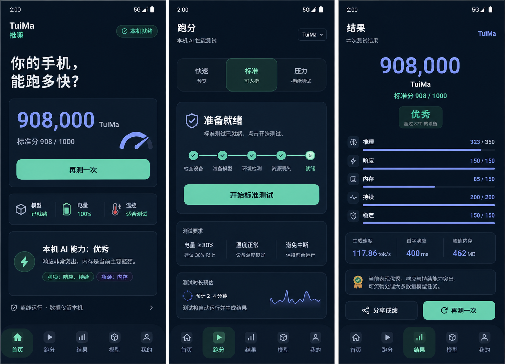
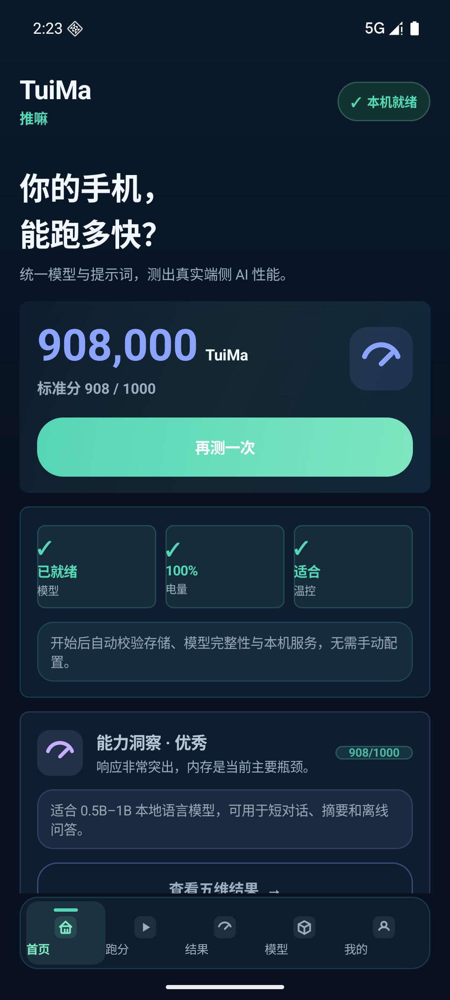
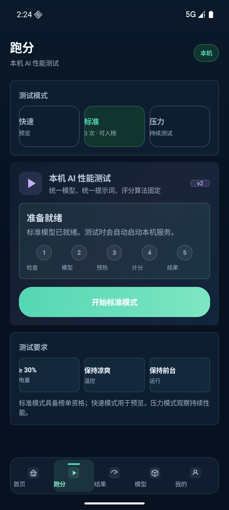
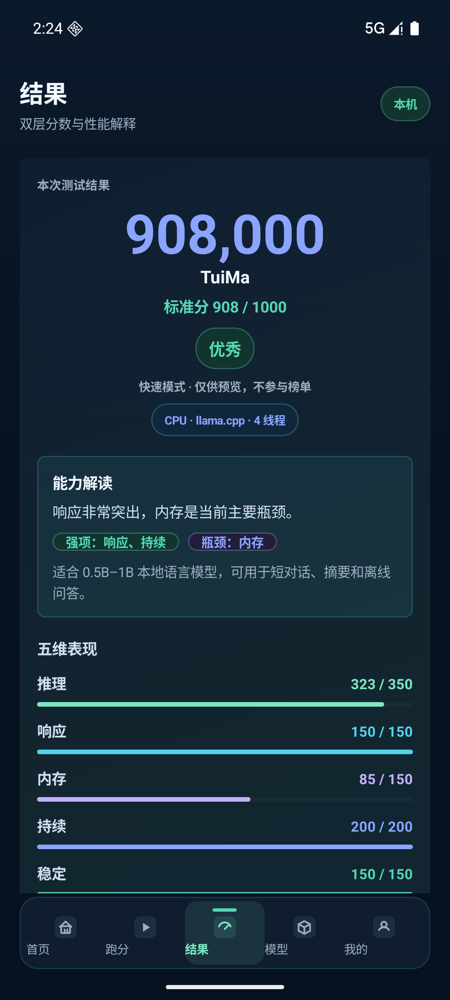

# TuiMa UI reference

The UI refresh uses a GPT Image 2 design board as a visual reference, then validates the Android implementation with emulator screenshots from the actual APK.

## Design reference

## Android implementation

| Home | Benchmark | Results |
|---|---|---|
|  |  |  |

Implementation source:

- `android-app/app/src/main/kotlin/ai/mobilecore/MainActivity.kt`
- `android-app/app/src/main/kotlin/ai/mobilecore/ui/TuiMaTheme.kt`
- `android-app/app/src/main/kotlin/ai/mobilecore/ui/TuiMaComponents.kt`

The design changes presentation and interaction only. Benchmark profiles, state transitions, scoring, and result calculations remain unchanged.
