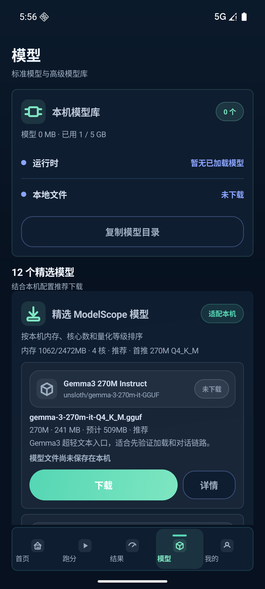

# TuiMa UI reference

The UI refresh uses a GPT Image 2 design board as a visual reference, then validates the responsive Android implementation with emulator screenshots from the actual APK.

## Design reference

## Android implementation

| Home | Benchmark |
|---|---|
|  |  |

| Results | Models |
|---|---|
|  |  |

Implementation source:

- `android-app/app/src/main/kotlin/ai/mobilecore/MainActivity.kt`
- `android-app/app/src/main/kotlin/ai/mobilecore/ui/TuiMaTheme.kt`
- `android-app/app/src/main/kotlin/ai/mobilecore/ui/TuiMaComponents.kt`
- `android-app/app/src/main/kotlin/ai/mobilecore/ui/ModelLifecycleUi.kt`
- `android-app/app/src/main/kotlin/ai/mobilecore/runtime/ModelLoadStatusContract.kt`

The screens use content-driven heights, adaptive page gutters, wrapping text, and minimum 48 dp actions to avoid collisions on narrow displays and at larger font scales. The model surfaces distinguish not downloaded, downloading, downloaded, loading, loaded, and failure states using runtime-confirmed state instead of treating a local file as an active model.

Benchmark profiles, scoring, and result calculations remain unchanged.
